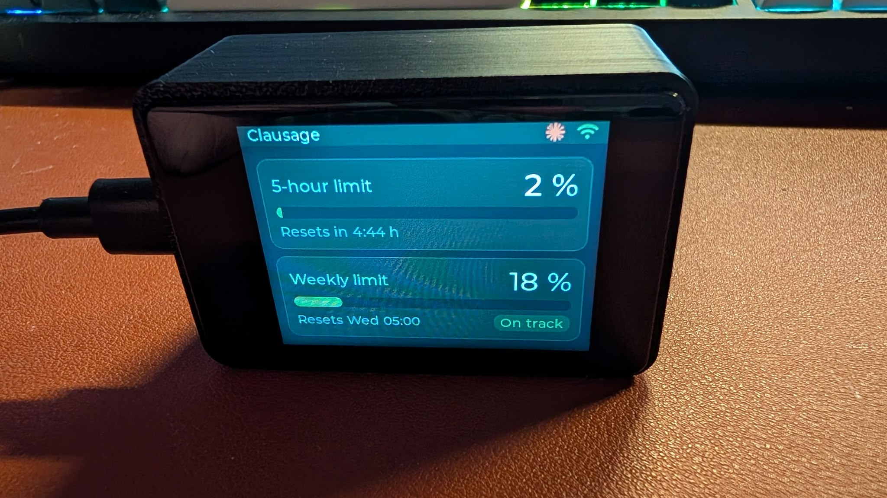
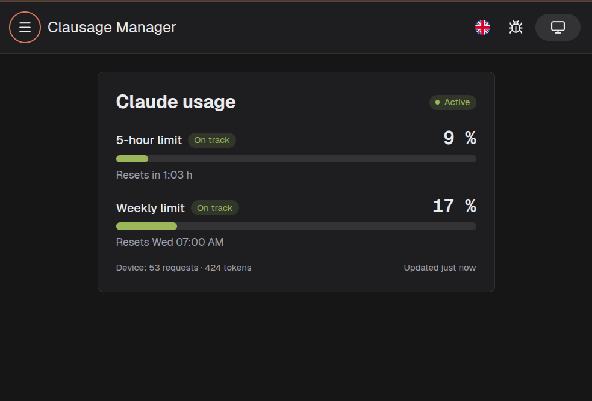
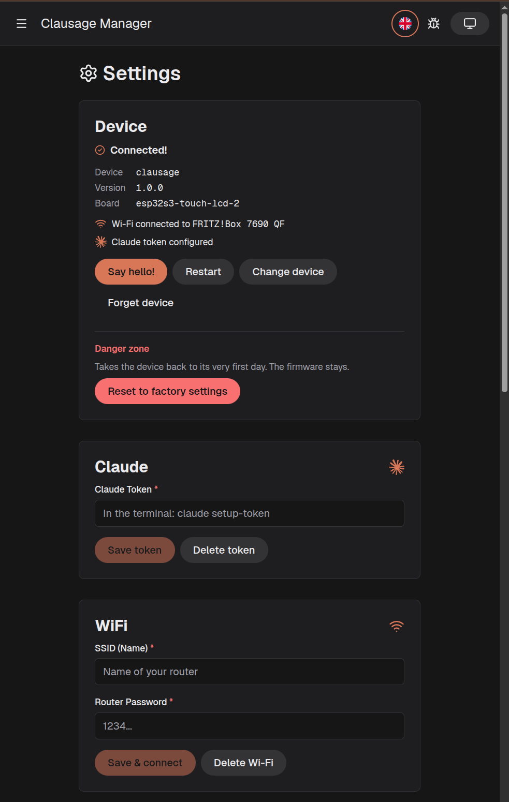
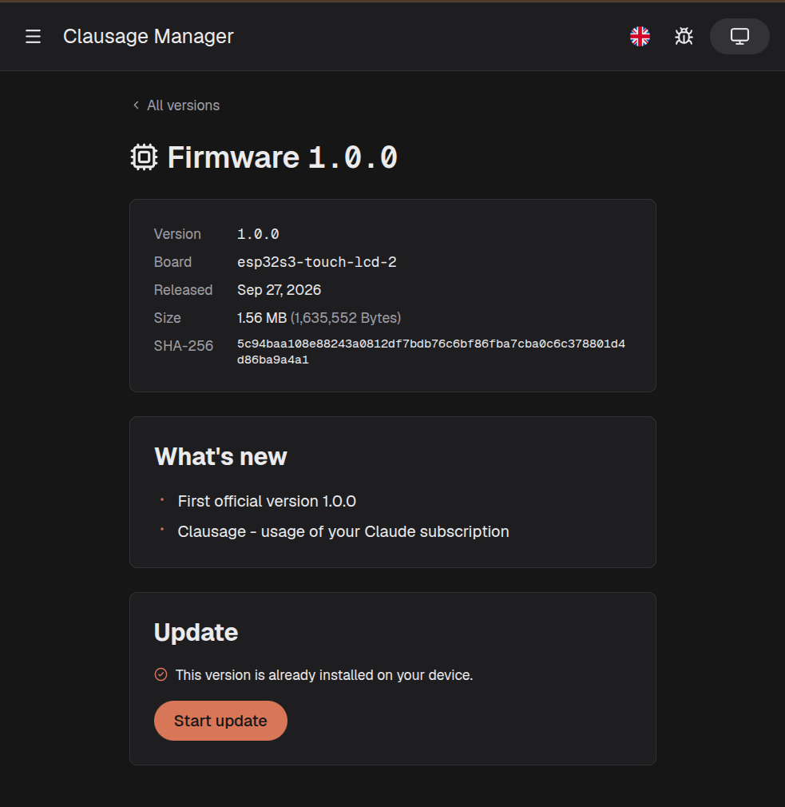
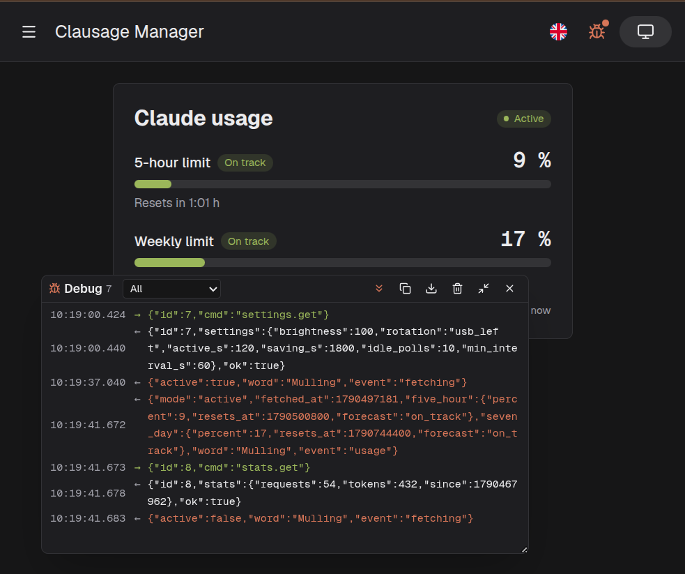

<p align="center">
  
</p>

<h1 align="center">Clausage Manager</h1>

<p align="center">
  The web app for <b>Clausage</b>, a small desk display that shows your Claude usage limits.<br>
  Install it on a new board, set it up, watch your usage and update it, all from the browser over USB.
</p>

<p align="center">
  <a href="https://clausage.fh-softdev.de"><b>Open the app: clausage.fh-softdev.de</b></a>
</p>

<p align="center">
  
  <br>
  <sub>The device itself. The web app below sets it up and keeps it up to date.</sub>
</p>



## What it does

- **Usage at a glance:** the 5-hour window and the weekly limit as bars, with the time until they reset
  and a forecast whether you will run out before that ("On track", "Tight", "Too fast").
- **Set up the device:** Wi-Fi, Claude token, time zone, brightness, screen orientation and how often
  the device asks Claude. Wi-Fi, token and usage update live, also when something changes on the
  device itself (a QR code scanned, the router gone).
- **Install on a new board:** plug in a fresh ESP32-S3 board, the app notices that no Clausage
  answers and installs it: bootloader, partition table and app in one go, settings erased. It checks
  first that the board really is an ESP32-S3 with 16 MB flash.
- **Firmware updates in the browser:** pick a version, the app downloads it, checks size, checksum
  and version, and flashes it over USB. If the new firmware doesn't start, the device rolls back on its own.
- **Debug log:** a floating panel shows every line between app and device, including the device's own
  logs. Handy while the web app holds the serial port and `idf monitor` can't.
- **Light and dark mode, English and German.**

| Settings                                   | Firmware update                                 | Debug log                                |
| ------------------------------------------ | ----------------------------------------------- | ---------------------------------------- |
|  |  |  |

## Requirements

The app talks to the device with [Web Serial](https://developer.mozilla.org/en-US/docs/Web/API/Web_Serial_API),
which only desktop browsers offer:

| Browser      | Since version |
| ------------ | ------------- |
| Chrome, Edge | 89            |
| Firefox      | 151           |

Phones and tablets are not supported. The device is a Waveshare ESP32-S3-Touch-LCD-2 running the
Clausage firmware.

## The Clausage projects

| Repo                                                                      | What                                                                           |
| ------------------------------------------------------------------------- | ------------------------------------------------------------------------------ |
| [Flo0806/clausage](https://github.com/Flo0806/clausage)                   | The device: firmware source (ESP-IDF, C), hardware, case, serial protocol      |
| [Flo0806/clausage-firmware](https://github.com/Flo0806/clausage-firmware) | Released firmware builds and the `manifest.json` this app reads                |
| [Flo0806/clausage-manager](https://github.com/Flo0806/clausage-manager)   | This web app, live at [clausage.fh-softdev.de](https://clausage.fh-softdev.de) |

## How it works

- **One JSON object per line** in both directions. Commands carry an `id`, the device answers with the
  same `id`. Messages the device sends on its own (`wifi`, `token`, `usage`, ...) carry an `event`.
  Everything else on the line is the device's log.
- **Pairing is the browser's:** once you picked the device, the app reconnects on its own after a
  reload or when you plug it in. "Forget device" removes the pairing again.
- **Firmware** comes from [clausage-firmware](https://github.com/Flo0806/clausage-firmware):
  a `manifest.json` lists every release with size, SHA-256, release notes and the full image for new boards.
- **Updates** go through the Clausage firmware itself: it writes the new app into its free update slot
  and switches over only when that worked.
- **First installs** talk to the chip's ROM bootloader instead, with Espressif's
  [esptool-js](https://github.com/espressif/esptool-js). It is loaded only when you install.
- **Your token never leaves the device again:** the app sends it once, the device never sends it back,
  and the debug log masks it.

## Development

```bash
pnpm install
pnpm dev          # dev server
pnpm test         # unit tests
pnpm lint         # oxlint + ESLint
pnpm build        # type check + production build
```

Built with Vue 3, Vite, UnoCSS, vue-router (file based routes in `src/pages`), vue-i18n, VueUse
and esptool-js.

```
src/
  composables/   serial.ts (port, protocol), device.ts (device state and commands),
                 firmware*.ts (releases, update, install), debugLog.ts
  components/    home/, settings/, update/, layout/, ui/
  pages/         index.vue, settings.vue, update/
  locales/       en.json, de.json
```

The serial protocol is tested against a simulated device (`src/__tests__/fakeDevice.ts`), so the update
flow can be checked without a board on the desk.

## Troubleshooting

**Chrome says "The device has been lost" right after connecting?** Tools based on pyserial
(`idf monitor`, `esptool`) leave the port in a state Chrome can't read. Reset it once:

```bash
stty -F /dev/ttyACM0 min 1
```

**"Could not connect"?** Another program probably holds the port. Close `idf monitor` or any other
serial terminal and try again.

## License

[MIT](LICENSE)

Clausage is a personal project and not affiliated with Anthropic. Claude is a trademark of Anthropic.
